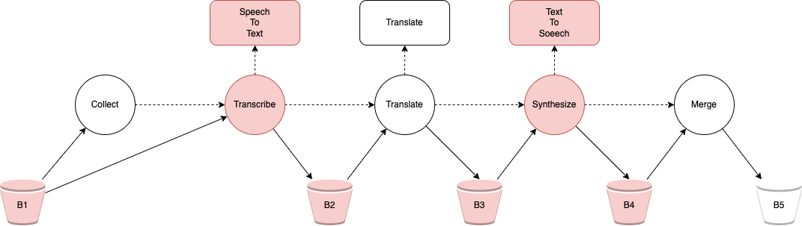

# Brute Force Scheduler

The scheduler is able to find the best placement for functions, services and storage by estimating the round trip time
of the functions for each possible placement using the model.

## Objective

The goal of the scheduler is to minimize two objectives:

1) UT + F2 + DT
2) UT + F4 + DT

UT is the upload time from the previous function to the input bucket. DT is the download time from the output bucket to
the next function. F2 and F4 are the round trip times of the respective serverless functions.

## Parameter Setup

The **computation time** is fixed per provider, hence it was measured for each function on every provider. 

The **overhead** can be reused for all functions in the same region, hence it was measured for a single function per
region.

The **input_size** can be learned from the workflow input, while **output_size** and **work_size** can be
learned from the workflow result. The workflow was executed with a single input file to learn those parameters. 

## Speedup

The performance of scheduled and non-scheduled FCs were compared. Each workflow was executed 3 times and the average
makespan was calculated. The scheduled version took 28.105 seconds, while the non-scheduled version took 48.425 seconds. This means that a speedup of 41.9% was achieved.  