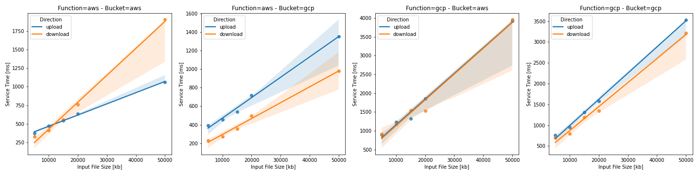
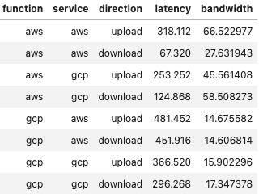
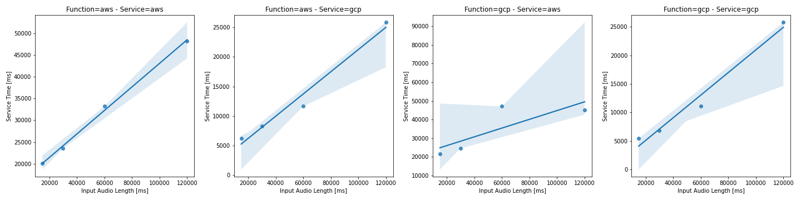
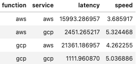
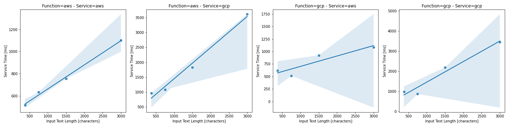
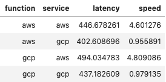

# Model

The model is able to estimate the service time depending on the input size. The service time is given by:

ST = l + w/v

Where l is the service latency, w is the work and v is the service speed. l and v are fixed by provider.

### Storage 

The down-up function was invoked with different input sizes and for each combination of function and service providers.
The upload and download times were measured and a linear regression curve was fitted to the measurements.

### Speech-To-Text 

The speech-recognition function was invoked with different input sizes and for each combination of function and service
providers. The input and output was always placed in the same region where the service was running. The service time
was measured and a linear regression curve was fitted to the measurements.

### Text-To-Speech 

The speech-synthesis function was invoked with different input sizes and for each combination of function and service
providers. The input and output was always placed in the same region where the service was running. The service time
was measured and a linear regression curve was fitted to the measurements.

## Modeling the RTT of serverless functions

By using the model it is possible to estimate the RTT of functions that use S2T or T2S services.

### Speech Synthesis

The input is downloaded to the function before invoking the service and the output is uploaded to the target bucket after invoking the service. Therefore, the formula includes additional download and upload times.

RTT = DT + T2S + UT + CT + O

### Speech Recognition

The output is uploaded manually to the target bucket. Therefore, the model includes an additional upload time. The input is processed directly from clous storage. Therefore, the model does not include an additional download time. However, data movements may be required, if input and service are on different providers. Therefore, additional download and upload times are included in the model. If no data movements are required, those parameters are zero. 

RTT = DT + UT + S2T + UT + CT + O
